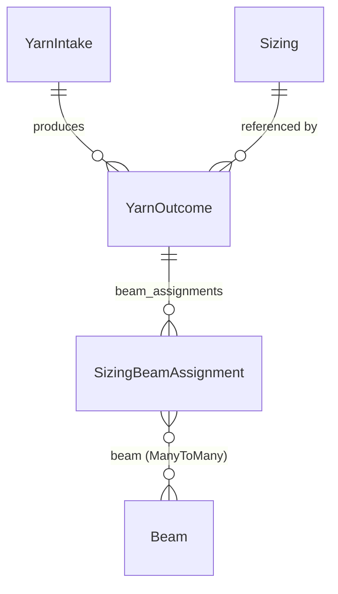

# Sizing Beam Assignment & Yarn Outcome Integration Documentation

## 1. Executive Summary

This document details the architectural refactoring of the **Sizing Beam Assignment** module and its integration with the **Yarn Outcome** workflow within the Harmony Factory Suite Backend.

### Key Objectives Completed:
1. **Transitioned Relationship Target**: Replaced legacy `sizing_outcome` ForeignKey in `SizingBeamAssignment` with `yarn_outcome = ForeignKey("factory.YarnOutcome", ...)`.
2. **Converted to Many-to-Many Beams**: Converted `beam` from a single `ForeignKey` to a `ManyToManyField("factory.Beam", ...)` allowing a single assignment lifecycle record to manage multiple physical beams simultaneously.
3. **Automated Assignment on Outcome Creation**: Automated the creation of a `SizingBeamAssignment` record whenever a `YarnOutcome` of type `Sizing` is created via `POST /api/v1/yarn-outcomes/`.
4. **Maintained Full Backward Compatibility**: Implemented dynamic properties (`beams`, `beam_id`, `beam_ids`, `sizing_outcome`, `sizing_outcome_id`) and dual-format serializers (`beam` object / `beams` array, `beamId` / `beamIds`).

---

## 2. Architecture & Data Model

### Entity Relationship Diagram



### Model Definition: `SizingBeamAssignment`
**File**: `factory/yarn/sizing/models.py`

```python
class SizingBeamAssignment(models.Model):
    class StatusChoices(models.TextChoices):
        ASSIGNED = "ASSIGNED", "Assigned"
        IN_USE = "IN_USE", "In Use"
        COMPLETED = "COMPLETED", "Completed"
        RELEASED = "RELEASED", "Released"

    yarn_outcome = models.ForeignKey(
        "factory.YarnOutcome",
        on_delete=models.PROTECT,
        related_name="beam_assignments"
    )

    beam = models.ManyToManyField(
        "factory.Beam",
        blank=True,
        related_name="sizing_assignments"
    )

    status = models.CharField(
        max_length=20,
        choices=StatusChoices.choices,
        default=StatusChoices.ASSIGNED
    )

    assigned_at = models.DateTimeField(auto_now_add=True)
    released_at = models.DateTimeField(null=True, blank=True)
    created_at = models.DateTimeField(auto_now_add=True)
    updated_at = models.DateTimeField(auto_now=True)
    created_by = models.ForeignKey(settings.AUTH_USER_MODEL, null=True, blank=True, on_delete=models.SET_NULL, related_name="created_sizing_beam_assignments")
    updated_by = models.ForeignKey(settings.AUTH_USER_MODEL, null=True, blank=True, on_delete=models.SET_NULL, related_name="updated_sizing_beam_assignments")

    class Meta:
        ordering = ["-assigned_at", "-id"]
        verbose_name = "Sizing Beam Assignment"
        verbose_name_plural = "Sizing Beam Assignments"
        indexes = [
            models.Index(fields=["yarn_outcome", "status"], name="factory_sba_yo_stat_idx"),
        ]
```

### Compatibility Properties & Lifecycle Hooks
- `beams`: Returns `self.beam` ManyToMany manager.
- `beam_id`: Returns the primary/first beam ID if assigned, otherwise `None`.
- `beam_ids`: Returns a list of all assigned beam IDs (`list(self.beam.values_list('id', flat=True))`).
- `sizing_outcome`: Traverses `self.yarn_outcome.sizing.outcomes.first()` for legacy callers.
- `__init__(*args, **kwargs)`: Automatically handles `beam`, `beams`, and legacy `sizing_outcome` initialization kwargs.
- `save(*args, **kwargs)`: Automatically persists initial beams passed during creation and guards against assigning beams that already have an active assignment (`ASSIGNED` or `IN_USE`).

---

## 3. Database Migrations

Three progressive migrations were created and applied:

| Migration File | Description |
| :--- | :--- |
| `0013_remove_sizingbeamassignment_factory_sba_so_stat_idx_and_more.py` | Dropped `sizing_outcome` FK and added `yarn_outcome` FK pointing to `YarnOutcome`. |
| `0014_remove_sizingbeamassignment_unique_active_sizing_assignment_per_beam_and_more.py` | Made `beam` nullable and updated conditional index. |
| `0015_remove_sizingbeamassignment_unique_active_sizing_assignment_per_beam_and_more.py` | Converted `beam` from `ForeignKey` to `ManyToManyField`, generated `factory_sizingbeamassignment_beam` join table, and removed obsolete single-column beam indexes/constraints. |

---

## 4. API Specification

### 4.1 Create Yarn Outcome & Auto-Assign Beams
**Endpoint**: `POST /api/v1/yarn-outcomes/`

#### Scenario A: Outcome with Multiple Beams
```http
POST /api/v1/yarn-outcomes/ HTTP/1.1
Content-Type: application/json

{
  "yarnIntake": 2,
  "outcomeType": "Sizing",
  "outcomeBags": 10,
  "outcomeConesPerBag": 43,
  "outcomeWeightPerBagKg": 12,
  "outcomeDate": "2026-10-04",
  "sizing": 1,
  "yarnBuyer": null,
  "ratePerKg": null,
  "beamIds": [101, 102, 103]
}
```

#### Scenario B: Outcome without Beams (Initial Sizing Registration)
```http
POST /api/v1/yarn-outcomes/ HTTP/1.1
Content-Type: application/json

{
  "yarnIntake": 2,
  "outcomeType": "Sizing",
  "outcomeBags": 10,
  "outcomeConesPerBag": 43,
  "outcomeWeightPerBagKg": 12,
  "outcomeDate": "2026-10-04",
  "sizing": 1,
  "yarnBuyer": null,
  "ratePerKg": null
}
```
*Note: In Scenario B, a `SizingBeamAssignment` record is automatically initialized in `ASSIGNED` status with 0 beams, ready for beams to be attached when physical dispatch occurs.*

#### Response Payload (`201 Created`):
```json
{
  "success": true,
  "message": "Yarn outcome created successfully.",
  "data": {
    "id": 25,
    "yarnIntake": 2,
    "outcomeType": "Sizing",
    "outcomeBags": 10,
    "outcomeConesPerBag": 43,
    "outcomeWeightPerBagKg": 12.0,
    "outcomeWeightKg": 120.0,
    "outcomeWeightLb": 264.55,
    "outcomeDate": "2026-10-04",
    "sizing": 1,
    "sizingDetail": {
      "id": 1,
      "sizingName": "Master Sizing Mills"
    },
    "yarnBuyer": null,
    "ratePerKg": null,
    "totalBeams": 3,
    "beamAssignments": [
      {
        "id": 12,
        "yarnOutcomeId": 25,
        "sizingOutcomeId": 25,
        "status": "ASSIGNED",
        "beamIds": [101, 102, 103],
        "beams": [
          { "id": 101, "beamNumber": "BN-101", "status": "SIZING" },
          { "id": 102, "beamNumber": "BN-102", "status": "SIZING" },
          { "id": 103, "beamNumber": "BN-103", "status": "SIZING" }
        ],
        "totalBeams": 3,
        "assignedAt": "2026-10-04T04:30:00Z",
        "releasedAt": null
      }
    ]
  }
}
```

---

### 4.2 Assign Additional Beams to an Existing Outcome
**Endpoint**: `POST /api/v1/yarn-outcomes/{id}/assign-beams/`

```http
POST /api/v1/yarn-outcomes/25/assign-beams/ HTTP/1.1
Content-Type: application/json

{
  "beamIds": [104, 105]
}
```

#### Response (`200 OK`):
```json
{
  "success": true,
  "message": "Successfully assigned 2 beam(s) to Yarn Outcome #25.",
  "data": {
    "yarnOutcomeId": 25,
    "totalBeamsAssigned": 5,
    "assignments": [
      {
        "id": 12,
        "yarnOutcomeId": 25,
        "beamIds": [101, 102, 103, 104, 105],
        "totalBeams": 5,
        "status": "ASSIGNED"
      }
    ]
  }
}
```

---

### 4.3 Query Beams on an Outcome
**Endpoint**: `GET /api/v1/yarn-outcomes/{id}/beams/`

#### Response (`200 OK`):
```json
{
  "success": true,
  "data": {
    "yarnOutcomeId": 25,
    "outcomeDate": "2026-10-04",
    "totalBeams": 5,
    "assignments": [ ... ]
  }
}
```

---

### 4.4 Transition Assignment Lifecycle
**Endpoint**: `POST /api/v1/sizing-beam-assignments/{id}/transition/`

Valid status flow: `ASSIGNED` -> `IN_USE` -> `COMPLETED` -> `RELEASED`.

```http
POST /api/v1/sizing-beam-assignments/12/transition/ HTTP/1.1
Content-Type: application/json

{
  "status": "IN_USE"
}
```
*Transitions all assigned physical beams to `LOADED` status.*

---

### 4.5 Release Beams Back to Available
**Endpoint**: `POST /api/v1/sizing-beam-assignments/{id}/release/`

Marks the assignment as `RELEASED`, records `released_at`, and returns all assigned physical beams to `AVAILABLE` status for reuse.

---

## 5. Serializer Specifications

### `SizingBeamAssignmentSerializer`
- Exposes:
  - `id`: Assignment primary key.
  - `yarnOutcomeId`: Associated `YarnOutcome` ID.
  - `beamIds`: Array of integer IDs for all linked beams.
  - `beamId`: Integer ID of the first beam (backward compatibility).
  - `beams`: Nested array of beam representations (`BeamMinSerializer`).
  - `beam`: Object representing the first beam (backward compatibility).
  - `totalBeams`: Count of beams assigned.
  - `status`: Lifecycle status (`ASSIGNED`, `IN_USE`, `COMPLETED`, `RELEASED`).
  - `assignedAt`, `releasedAt`, `createdAt`, `updatedAt`, `createdBy`, `updatedBy`.

### `YarnOutcomeSerializer`
- Exposes:
  - `beamAssignments`: Serialized array of beam assignments.
  - `totalBeams`: Distinct count of non-released beams attached to this outcome.
  - Write-only inputs: `beamIds`, `beam_ids`, `beamId`, `beam`.

---

## 6. Admin & UI Integrations

- **Admin View**: `factory/yarn/sizing/admin.py`
  - Configured `filter_horizontal = ["beam"]` for intuitive many-to-many beam selection.
  - Provided custom `display_beams` method to list all assigned beam numbers in the changelist without triggering Django admin `E109`.
- **Filtering**: `factory/yarn/sizing/filters.py`
  - `beam`: Filter assignments matching a given beam ID across the ManyToMany join table.
  - `yarn_outcome`: Filter assignments by `yarn_outcome_id`.

---

## 7. Testing & Verification

The complete sizing and beam management test suite was executed and passed with zero errors:

```powershell
python manage.py test factory.tests.test_sizing_beam_workflow
```

### Result:
```
Ran 33 tests in 79.331s
OK (0 errors, 0 failures)
```

### Key Scenarios Validated:
1. `POST /api/v1/yarn-outcomes/` with `outcomeType="Sizing"` automatically creates a `SizingBeamAssignment` linked to `YarnOutcome.id`.
2. `POST /api/v1/yarn-outcomes/` with explicit `beamIds` attaches all beams to the ManyToMany assignment and transitions them to `SIZING`.
3. Validation prevents assigning beams that already have an active (`ASSIGNED` or `IN_USE`) assignment.
4. Deleting a `YarnOutcome` releases all active assigned beams back to `AVAILABLE`.
5. Lifecycle transitions properly update both assignment and beam statuses.
